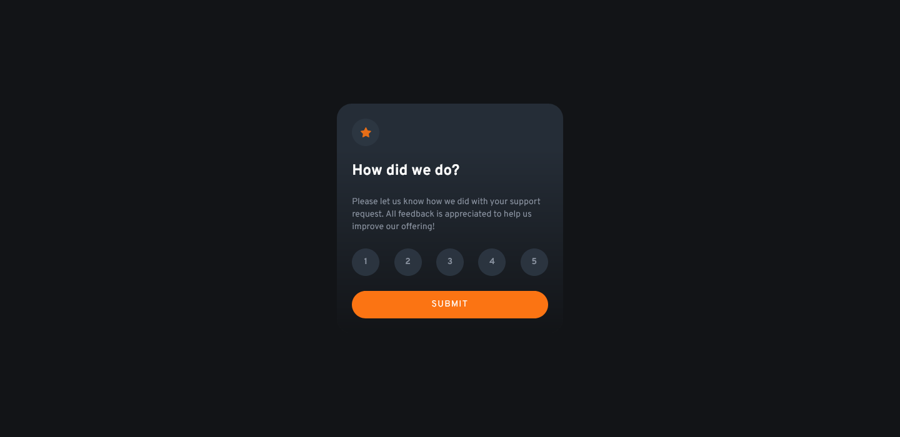
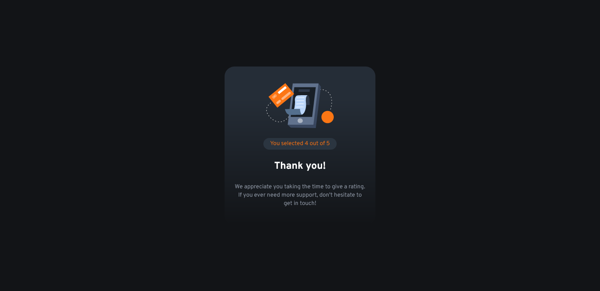
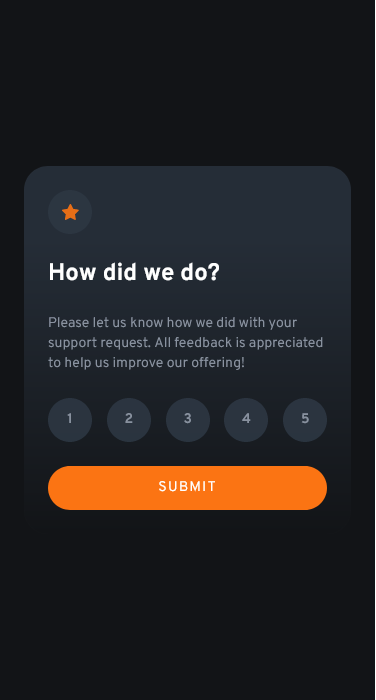

# Frontend Mentor - Interacite rating component solution

This is a solution to
the [Interactive rating component challenge on Frontend Mentor](https://www.frontendmentor.io/challenges/interactive-rating-component-koxpeBUmI).
Frontend Mentor challenges help you improve your coding skills by building realistic projects.

## Table of contents

- [Overview](#overview)
    - [The challenge](#the-challenge)
    - [Screenshots](#screenshots)
- [My process](#my-process)
    - [Built with](#built-with)
    - [What I learned](#what-i-learned)
    - [Useful resources](#useful-resources)
- [Author](#author)

## Overview

### The challenge

Users should be able to:

- View the optimal layout for the app depending on their device's screen size
- See hover states for all interactive elements on the page
- Select and submit a number rating
- See the "Thank you" card state after submitting a rating

### Screenshots

## My process

### Built with

- Semantic HTML5 markup
- Tailwind CSS
- Mobile-first workflow

### What I learned

Using Tailwind CSS

### Useful resources

- [Tailwind documentation](https://tailwindcss.com/docs) - You don't need much more than knowing CSS and reading the
  tailwind documentation to learn everything about tailwind.

## Author

- GitHub - [YounesMakhlouf](https://github.com/YounesMakhlouf)
- Frontend Mentor - [@younesmakhlouf](https://www.frontendmentor.io/profile/YounesMakhlouf)